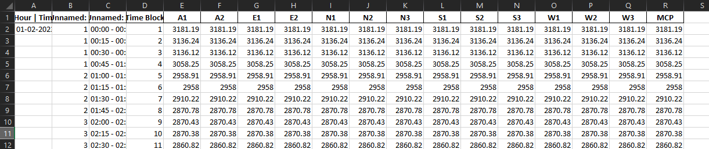
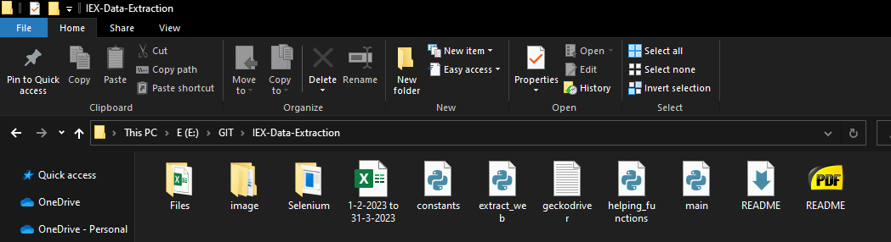
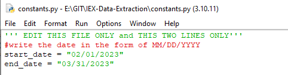
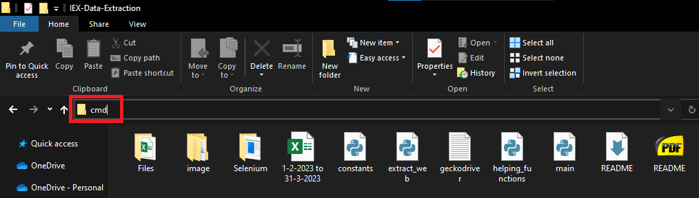
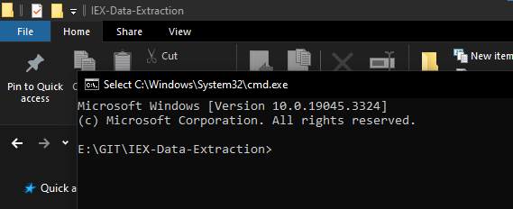
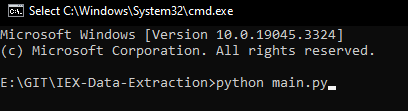
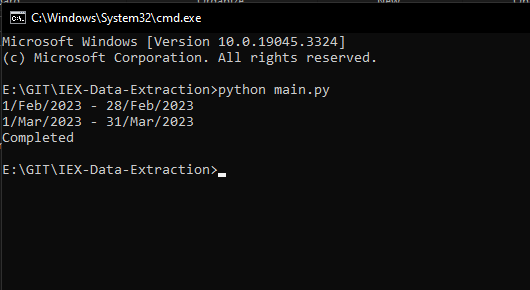
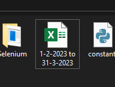

# Data Extraction

## Introduction

This folder got files and codes to extract data from IEX website for Day Ahead Market - Area Price for any date with interval of 15 minutes.

Give your date input and get all the datas in one single file.

This program will also convert the numbers saved as text in excel to numerical value. Also additional Time Block column has been added. The final excel sheet will look like.



## Setup

In the zip file, these are the folder and files



1. Extract the zip file
2. Requirement

* Python 3
  * Download Python from this website ([Python 3.10](https://www.python.org/ftp/python/3.10.11/python-3.10.11-amd64.exe)) and install python.
  * This [documentation](https://docs.python.org/3/using/windows.html#the-full-installer) can be consulted for guidance on the installation process.
* Firefox browser
  * Download firefox from [here](https://www.mozilla.org/en-US/firefox/new/).

3. Installing python libraries
   After installation of python, install the required libraries. Open the Windows Command Prompt and input these commands, then press "Enter."

   * Pandas

     ```
     pip install pandas
     ```
   * selenium

     ```
     pip install selenium
     ```

     If these commands are executed correctly, it indicates the successful installation of these libraries.

## Python files

The code is splitted into three:

1. main.py
2. extract_web.py
3. helping_functions.py
4. constants.py

### main.py

This is the main code that needs to be run to execute the whole program.

This code will process the dates and then give this as input to other two code.

### extract_web.py

This code is to work on the web and scrap the data from the website.

Here we have two input the web driver location (here Firefox web driver is used) and the path where we want to downloaded files need to be placed is also an input here.

### helping_functions.py

This code contains functions that we are using repeatedly for our task.

### constants.py

This code contains all the input and only this file needs to be edited.

Open this file with a text editor or Python IDLE (right click on the file and click on "open with" and select this option).

Edit the start and end date.



## Run the Program

To run the program, open the folder containing all the files, and type cmd in address bar.



This will open command prompt in the working folder location.



Type:

> python main.py



and press enter.

If the code runs successfully, it will look like this.



The final sheet will be saved with the title of the start and end date.



## Errors

If ever a error message is shown, run the program again.
