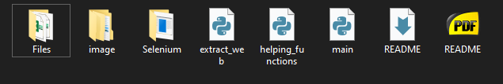
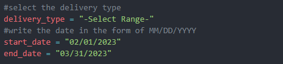
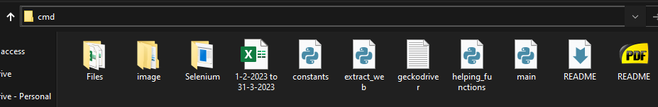
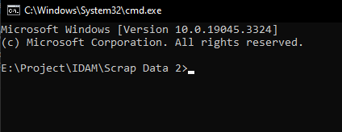

# Data Extraction

## Introduction

This folder got files and codes to extract data from IEX website for any date with 15 minutes block. Give your date input and get all the datas in one single file.

## Setup

In the zip file, these are the folder and files



1. Extract the zip file
2. Requirement

* Python 3
* Firefox browser

3. Installing python libraries

   * Pandas

     ```
     pip install pandas
     ```
   * selenium

     ```
     pip install selenium
     ```

## Python files

The code is splitted into three:

1. main.py
2. extract_web.py
3. helping_functions.py
4. constants.py

### main.py

This is the main code that needs to be run to execute the whole program. Here we will be giving the input of the type of delivery, start date and end date. This code will process the dates and then give this as input to other two code.

### extract_web.py

This code is to work on the web and scrap the data from the website. Here we have two input the web driver location (here Firefox web driver is used) and the path where we want to downloaded files need to be placed is also an input here.

### helping_functions.py

This code doesn’t need any input, this code contains functions that we are using repeatedly for our task, there is no need to modify this code.

### constants.py

This code contains all the input and only this file needs to be edited.

Edit the start and end date and the delivery type in this file



## Run the Program

To run the program, open the folder containing all the files, and type cmd in address bar.



This will open command prompt.



Type:

> python main.py

and press enter.

## Errors

If ever a error message is shown, run the program again.
