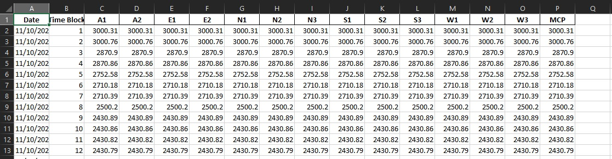
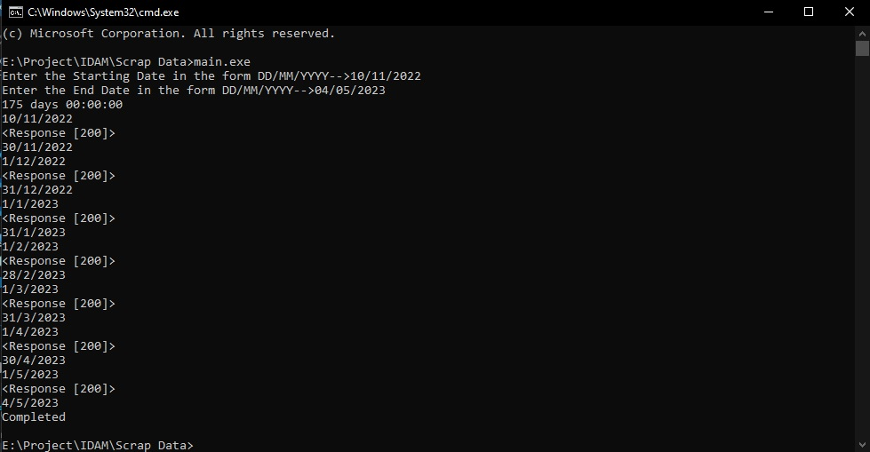

# Data Extraction

## Introduction

This folder got files and codes to extract data from IEX website for Day Ahead Market - Area Price for any date with interval of 15 minutes.

Give your date input and get all the datas in one single file.

This program will also convert the numbers saved as text in excel to numerical value. Also additional Time Block column has been added. The final excel sheet will look like.

With the help of API the datas are extracted. The sample method is mentioned in this website https://www.iexindia.com/Uploads/Reports/12_05_2022IEX_Market%20Data%20API_Document.pdf.

This is the final output excel sheet.

## Setup

From this website:

https://github.com/vicky-nike/IEX-Data-Extraction/

Download the zip file by clicking on "Code" and then "Download Zip".

Extract the zip file into a folder.

In the zip file, these are the folder and files

Double click on ***main.exe*** file. And Input the start date and press enter, and then put end date and press enter.

### Output

Output will look like this. And the application will close itself.

The excel will be saved in the same directory with name that of the starting date and ending date.

## Errors

If ever a error message is shown, run the program again.

---

## Extras

### Python files

The code is splitted into Two:

1. main.py
2. helping_functions.py

#### main.py

This is the main code that needs to be run to execute the whole program.

This code will process the dates and then give this as input to other two code.

#### helping_functions.py

This code contains functions that we are using repeatedly for our task.
